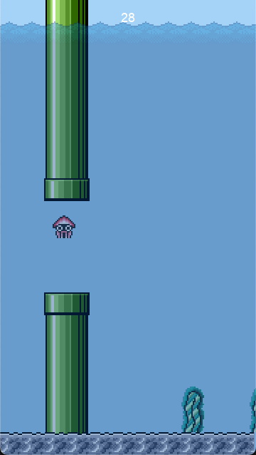

# Swimmy Squid
## Overview

Swimmy Squid is a game inspired by Flappy Bird, utilizing assets from Super Mario Bros. 3 featured in Super Mario All-Stars.



## Prerequisites
Before you begin, ensure you have met the following requirements:

- [Python](https://www.python.org/) (3.x or above) is installed
- pip is installed
  ```shell
  python ensurepip
  ```
- [git](https://git-scm.com/downloads) is installed

## Installation
Follow these steps to get Swimmy Squid up and running on your machine:

1. **Clone the Repository**:
   Use git to clone the project to your local machine:
   ```shell
   git clone https://github.com/zephenryus/swimmy_squid.git
   ```

2. **Navigate to the Project Directory**:
   Change into the project directory from the terminal or command line:
   ```shell
   cd path/to/swimmy-squid
   ```

3. **Install Dependencies**:
   Ensure `pygame`, the core dependency for the game, is installed:
   ```shell
   pip install -r requirements.txt
   ```

4. **Run the Game**:
   Execute the following command to start the game:
   ```shell
   python main.py
   ```

Enjoy playing Swimmy Squid!